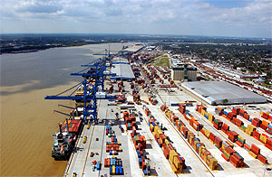

## NATIONAL STRATEGY FOR THE MTS

### Channeling the Maritime Advantage (2017-2022)

> _The United States marine transportation system will be a safe, secure, clean, and globally integrated network that, in harmony with the environment, ensures a free-flowing, seamless, and reliable movement of people and commerce along its waterways, sea lanes, and intermodal connections._

         #### - CMTS Vision of the MTS
           Approved by the U.S. Committee on the Marine Transportation System – October 2017 
           

|The 2017 National Strategy for the Marine Transportation System: Channeling the Maritime Advantage (2017 National Strategy) was developed by the CMTS members through interagency engagement and multiple reviews before being signed by Transportation Secretary Elaine L. Chao on November 17, 2017. The 2017 National Strategy replaces the 2008 National Strategy and provides strategic guidance to the Federal interagency partnership to enhance the Federal understanding and support of the marine transportation system (MTS) under five priority areas:|  |
|:-|--|
|  | |

-   **Optimize System Performance:** Measuring the reliability of physical and operational elements of the MTS to inform and support strategies for targeted improvements as trade and supply chain competitiveness increases.
-   **Enhance Maritime Safety:** Promoting an MTS free from collisions, allisions, groundings, and injury, death, and damage to property and environment as congestion and maximum vessel size within the MTS increases.
-   **Support Maritime Security:** Evaluating the infrastructure and operations of the MTS, taking into account possible threats and vulnerabilities while continually assessing existing protective measures, procedures, and operations, supported by efforts to understand and incorporate maritime domain awareness into shipping activities.
-   **Advance Energy Innovation and Development:** Identifying opportunities to utilize all sources of domestic energy and implement new technologies to ensure energy independence and more efficient fuel use.
-   **Facilitate Infrastructure Investment:** Using all available resources efficiently and effectively for the improvement of the MTS.

Taking into account the recommendations from GAO to include performance metrics in the National Strategy, the five priority areas now include actions with accompanying measures of success to track and show progress toward achieving the objectives. There are 14 actions for CMTS interagency engagement in the 2017 National Strategy under the five priority areas, as outlined in Section 3.

This Strategy will be implemented across Federal agencies and within the CMTS partnership, as appropriate. The CMTS will assist in coordinating and tracking the actions and measures through the Executive Secretariat, Integrated Action Teams, Task Teams, or a mechanism to be developed as needed. The CMTS will also align its current and future annual work plans with the approved 2017 National Strategy. While the 2017 National Strategy is a living document that must also meet emerging issues, the CMTS will make progress on each action within the next five years, with the goal of completing most, if not all, of the actions within those five years, pursuant to agency engagement, resources, and Administration policy.

[MTS National Strategy](../assets/uploads/documents/National_Strategy_for_the_MTS_October_2017.pdf)
